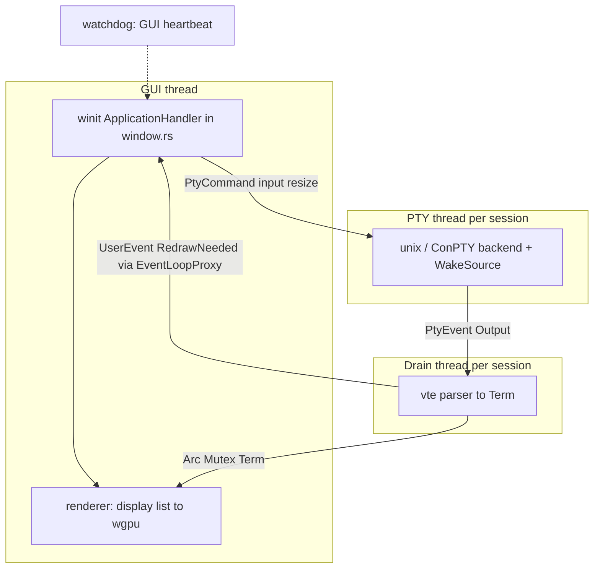

# Architecture

Baud runs a single GUI process with a winit event loop on the main thread and one PTY reader thread plus one drain thread per session. There is no application async runtime: coordination uses `std::thread`, `std::sync::mpsc`, and winit's `EventLoopProxy`.

## Process and threads

Bootstrap lives in `src/event_loop.rs` (`run`, `spawn_session`). The GUI owns the window and the renderer; each session owns a PTY backend and a drain that advances the VTE parser against shared terminal state.

## Shared terminal state

Each session holds `Term` behind `Arc<Mutex<Term>>` (`src/session.rs`). The drain thread locks the mutex to parse bytes; the GUI locks it to read cells for display lists, selection, and input side effects. When the lock is contended, the watchdog can record a busy signal; the GUI still never blocks the PTY reader thread itself — the reader only pushes into an `mpsc` channel.

## Redraw path

After the drain applies output, it marks the session dirty and sends `UserEvent::RedrawNeeded` through the event-loop proxy (`src/window.rs`). On the GUI thread:

- The focused session requests a window redraw unless synchronized output is active (`Term::should_defer_redraw`, DEC 2026).
- Other panes on the active tab may still request a redraw so their damage is painted.
- Sessions on inactive tabs stay dirty until that tab is shown.

Input and resize travel the other way: the GUI sends `PtyCommand` values (`Input`, `Resize`, `Interrupt`, `Shutdown`) on a channel that always wakes the PTY thread via `WakeSource`.

## Watchdog

`src/watchdog.rs` can spawn a `baud-watchdog` thread when `diagnostics.watchdog` is enabled. It watches heartbeat generation and slow GUI handlers (on the order of hundreds of milliseconds) and emits warnings. It does not take over the event loop; it only observes.

## `window.rs` size and seams

`src/window.rs` is the largest single application file (~5000 lines). One `App` type implements winit's `ApplicationHandler` and also owns overlays, tab/pane operations, and selection policy. That concentration is real coupling, not an accident of naming. Three seams already show up as method clusters and are the natural extract targets for a later refactor (this page only names them):

1. **Overlays.** Key handlers such as consent, theme picker, copy mode, and search share one shape: take a key event, return whether it was consumed. IME preedit state lives here too.
2. **Multiplexing.** Tab and pane operations (`new_tab`, `close_tab_at`, `split_pane`, focus and swap helpers, tab-bar hit tests) touch `TabLayout` and `SessionHost`, not winit types directly.
3. **Selection policy.** Copy, double-click expand, selection extend helpers, and copy-on-select timers hold policy while `src/selection.rs` holds the model. Local selection versus application mouse reporting is decided in the window layer.

## Where to change this

| Change | Start in |
| --- | --- |
| Session spawn, drain coalesce, redraw rate | `src/event_loop.rs` |
| User events, redraw deferral, GUI routing | `src/window.rs` |
| Session handle fields | `src/session.rs` |
| Stall detection | `src/watchdog.rs` |
