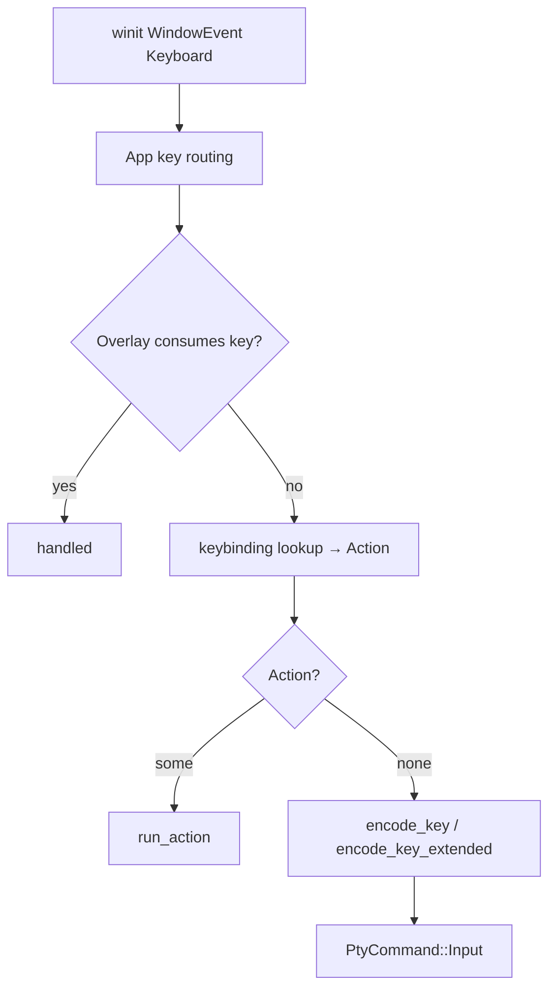

# Input

Key and pointer events enter through winit on the GUI thread (`src/window.rs`), become actions or encoded bytes, and either run locally or go to the focused session's PTY.

## Key press path

Overlays (consent, theme picker, copy mode, search) get first refusal. Unbound keys are encoded for the terminal; bound keys run `Action` handlers in `src/input/actions.rs` (copy/paste, scroll, tabs, panes, font zoom, search, and related).

## Classic encoding vs CSI u

`src/input/keymap.rs` owns both paths, driven by terminal modes on `Term`:

- **Classic:** ctrl characters, alt as ESC-prefix, CSI/SS3 cursors, `~` keys, function keys — the usual xterm-style stream. With `modify_other_keys` active (level 1 or 2), modified "other" keys (Enter, Escape, and at level 2 Tab and Backspace) that lack a standard one-byte form are encoded as `CSI code;mod u` instead; see the [Terminal API](../vt/index.md#modifyotherkeys-xtmodkeys) page for the exact bytes.
- **Extended (CSI u):** when `keyboard_flags` is non-zero (set by the CSI u protocol in `src/ansi/`), `encode_key_extended` may emit `\x1b[{codepoint};{modifiers}u`. If extended encoding returns nothing for that key, the classic path is used. Not every key is on the u-form yet (arrows, function keys, and page keys are among the classic holdouts).

`KeyModes` also carries app cursor keys, app keypad, newline mode, and the `modify_other_keys` level for classic sequences.

Binding overrides and the full `Action` set live in `src/input/actions.rs`. Defaults and user chords are documented in the generated [Keybindings reference](../reference/keybindings.md); this page only describes the machinery.

## Wheel

`src/input/wheel.rs` converts line and pixel deltas (with residual accumulation for trackpads) into a `WheelIntent`:

- **Forward report** — application mouse wheel buttons when the app owns the wheel.
- **Local lines** — scroll the local scrollback.
- **Faux lines** — synthesize arrow input on the alternate screen when appropriate.

Ownership hints distinguish application reporting from host scrolling. Acceleration and related config keys are applied on this path; start in `wheel.rs` and the config keys it reads.

## IME preedit

The window layer keeps preedit text and cursor offset, enables IME on the winit window, and updates the IME area from the cell cursor. `WindowEvent::Ime` commits text into the paste/send path or updates preedit for redraw. The renderer draws `PreeditState` over the cursor; it is not stored in `Term`.

## Where to change this

| Change | Start in |
| --- | --- |
| Escape sequences for keys | `src/input/keymap.rs` |
| New bindable action | `src/input/actions.rs` and `App::run_action` in `src/window.rs` |
| Wheel / trackpad feel | `src/input/wheel.rs` |
| IME caret and preedit drawing | `src/window.rs`, renderer preedit hook |
