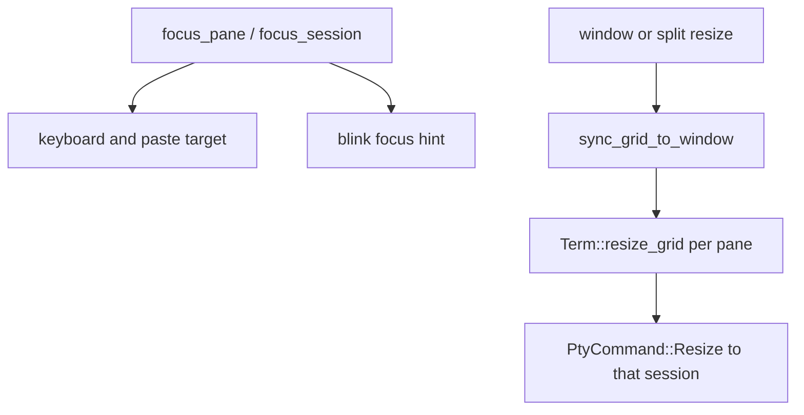

# Multiplexing

Baud multiplexes **tabs** and **panes**. Each pane leaf owns one **session** (PTY + `Term`). User-facing behavior is in [Tabs and splits](../features/tabs-and-splits.md); this page is the ownership map.

## Sessions

`src/session.rs` is a thin handle: session id, `Arc<Mutex<Term>>`, PTY command sender, title, dirty flag, and exit-hold options. Spawning and joining threads happens in `src/event_loop.rs` (`spawn_session`). The GUI keeps `SessionHost` entries (session plus drain/PTY join handles) in `src/window.rs`.

Closing a pane shuts down that session's backend and joins its threads. Opening a tab or split spawns a new session the same way as the first.

## Tabs

`App` holds `tabs: Vec<TabLayout>` and a focused tab index. Each `TabLayout` has a layout root, the focused session id in that tab, and pane MRU data for focus restore. Tab bar chrome and hit testing live in `src/renderer/tab_bar.rs`; actions such as new/close/next/prev/goto tab are in `src/input/actions.rs` and executed on `App`.

## Split tree (dwindle)

`src/layout.rs` models a binary tree:

- `Layout::Leaf(SessionId)`
- `Layout::Split { orientation, ratio, preserve_orient, a, b }`

Orientation follows a dwindle rule (`recalc_dwindle_orients`, `split_dwindle_ordered`): new splits alternate in a fixed pattern rather than requiring the user to pick every axis. Helpers under `src/layout/` add smart placement from the pointer (`smart_split.rs`) and spatial neighbor focus (`spatial.rs`).

Toggle and swap split orientation, close pane, and directional focus are operations on `TabLayout` that the window layer invokes.

## Focus and resize

Only the focused session receives typed input. Resize walks the tree, assigns pixel rects to leaves, resizes each `Term` grid, and when the cell size changes sends `PtyCommand::Resize` on that session's channel so the child sees the new winsize.

## Where to change this

| Change | Start in |
| --- | --- |
| Tree shape, dwindle rules, ratios | `src/layout.rs` |
| Pointer-aware split placement | `src/layout/smart_split.rs` |
| Directional focus | `src/layout/spatial.rs` |
| Tab/pane actions and PTY resize sync | `src/window.rs` |
| Tab bar visuals and clicks | `src/renderer/tab_bar.rs` |
