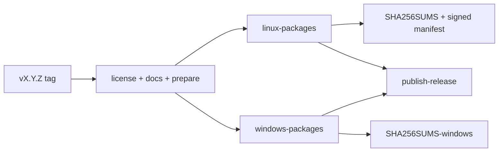

# Release

Releases are git-tag driven. Crates.io publish is off; artifacts ship on GitHub Releases.

## Version pull request (`release-plz`)

Configuration: `release-plz.toml`.

| Setting | Value |
| --- | --- |
| `git_only` | `true` |
| `publish` | `false` (no crates.io) |
| `git_tag_name` | `v{{ version }}` |
| `release_commits` | `^(feat\|fix\|perf\|security)(\([^)]+\))?:` |
| Changelog groups | packaging → Packaging; feat → Added; fix → Fixed; perf → Performance; security → Security |
| Skipped from changelog | `docs`, `test`, `ci`, `build`, `chore`, `refactor`, and a catch-all skip |

On push to `master`, when automation vars are enabled, `release-plz.yml` opens or updates a Release PR. Merging that PR lets `release-plz release` create the `vX.Y.Z` tag. Manual version bumps outside that flow must satisfy `tools/ci/verify_release_policy.sh` (often via a `release:manual-version` label).

## Tag gate

`release.yml` runs on tags matching `v*.*.*` (and on `workflow_dispatch` as a dry run that does not publish).

`prepare-release` requires:

- Tag form `vX.Y.Z`
- Version equal to `package.version` in `Cargo.toml`
- Draft GitHub release created when publishing

## License gate

`license-gate` checks that `LICENSE` exists and that `Cargo.toml` declares `license = "Apache-2.0"`.

## Docs gate

`docs-gate` runs `cargo run --bin docs-gen -- --check` and `mdbook build docs/site` (with mdbook-mermaid available). A broken site blocks the release.

## Artifact pipeline (overview)

Linux builds deb, rpm, AppImage, and the desktop-bundle tarball, writes `SHA256SUMS`, signs `update-manifest.json`, and runs `tools/packaging/verify_release_assets.sh`. Windows builds the portable zip and MSI plus `SHA256SUMS-windows`. When both succeed and publish mode is on, `publish-release` undrafts the GitHub release.

Exact scripts and file names: [Packaging](packaging.md). End-user update behavior: [Updates](../features/updates.md). Trust checks: [Security model](security-model.md).
