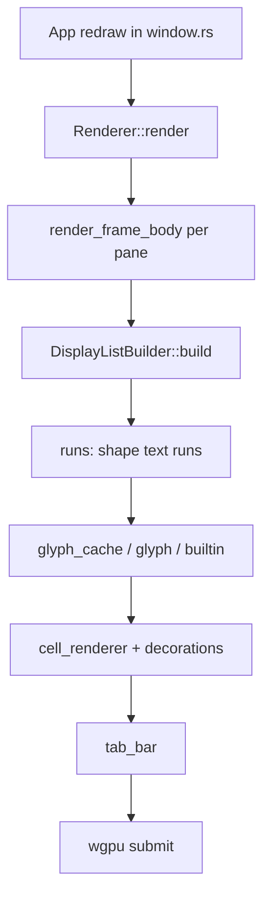

# Rendering

The GPU path turns `Term` state into a wgpu frame. Almost all of it lives under `src/renderer/`; the GUI thread drives it from `src/window.rs` on redraw.

## Frame path

1. `App` builds a list of panes (session `Term`, layout rect, focus, whether to rebuild) and calls `Renderer::render`.
2. The renderer acquires the surface texture. Consent and theme-picker-only paths short-circuit before a full terminal frame.
3. Per pane, damage decides a full or incremental rebuild of a `DisplayList` (`bg_quads`, `line_quads`, `text_glyphs`, cursor geometry), cached by session id.
4. `runs.rs` groups cells into shaped runs for glyphon (breaking runs around hyperlinks and attribute changes).
5. `glyph.rs` and `glyph_cache.rs` resolve rasterized glyphs; `builtin/` draws box-drawing, block elements, and Powerline separators as geometric custom glyphs when fonts are a poor fit.
6. `cell_renderer.rs` and `decorations.rs` turn the display list into glyphon buffers (underlines, cursor quads, solid masks).
7. `tab_bar.rs` lays out tab chrome and hit targets; the renderer composites it with the panes.
8. Window opacity comes from config: clear color alpha and the window's alpha mode (including platform backdrop choices when opacity is below 1).

Search and theme-picker overlays, and IME preedit, are drawn in the same pass as extra glyphon content.

## Synchronized output

DEC 2026 is not a separate renderer mode. While `Term::should_defer_redraw()` is true, `UserEvent::RedrawNeeded` keeps the session dirty without calling `request_redraw`. A blink/sync timer wakes the GUI when the sync window ends or times out. See [Terminal model](terminal-model.md).

## Metrics

`src/renderer/metrics.rs` and related hooks support FPS and frame timing when enabled from the action layer. They observe the path above; they do not change how cells are built.

## Where to change this

| Change | Start in |
| --- | --- |
| What geometry is built from cells | `src/renderer/display_list.rs`, `runs.rs` |
| Glyph raster / cache | `src/renderer/glyph_cache.rs`, `glyph.rs`, `builtin/` |
| Underlines, cursor drawing | `src/renderer/decorations.rs`, `cell_renderer.rs` |
| Tab chrome | `src/renderer/tab_bar.rs` |
| Surface, clear, opacity, submit | `src/renderer/mod.rs`, window creation in `src/window.rs` |
