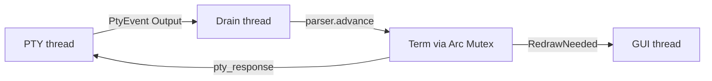

# Terminal model

Bytes from the PTY become cells on a grid through the VTE parser and `Term`. Rendering and input read that state; they do not re-parse escape sequences.

## Parse path

1. The PTY thread reads master output and pushes `PtyEvent::Output` (`src/event_loop.rs`, `src/pty/`).
2. The drain thread locks `Term`, runs `vte::Parser::advance`, and may queue `PtyCommand::Input` for replies (DA, DSR, and similar).
3. After a coalesced pass (capped per pass), the drain marks damage and sends `UserEvent::RedrawNeeded`.

`impl vte::Perform for Term` lives in `src/ansi/mod.rs` (`print`, `execute`, `csi_dispatch`, `esc_dispatch`, `osc_dispatch`, plus DCS paths).

## `Term` state

High-signal areas owned by `Term` in `src/ansi/mod.rs`:

| Area | What it holds |
| --- | --- |
| Buffers | Primary `grid`, `alt_grid`, alt-screen flag, scroll region, scrollback offset |
| Cursor and attributes | Cursor, current `Attrs` (fg/bg, bold/italic/underline styles, …), visibility and blink |
| Modes | Auto-wrap, bracketed paste, app cursor/keypad, origin/insert/newline, `keyboard_flags` (CSI u stack), `modify_other_keys` (XTMODKEYS level) |
| Synchronized output | `sync_update_active` and `should_defer_redraw` (DECSET/DECRST 2026, with a timeout) |
| Prompt marks | OSC 133 marks, reconciled when scrollback trims |
| Links | Hyperlink table, per-cell link id, hover range |
| Mouse | Click/drag/any-motion, SGR, focus reporting |
| UX attachments | Selection, copy mode, search, OSC 52 clipboard pending, titles, cwd, palette overrides |

The grid types themselves live under `src/grid/`; `Term` is the policy and protocol layer on top.

## Grid and scrollback

`src/grid/mod.rs` defines `Grid`, `Cell`, and scrollback as a `VecDeque` of rows with a configured maximum. Soft-wrapped row continuations are tracked so reflow and selection stay consistent. Each cell stores the primary character, attributes, display width, optional hyperlink id, and extra codepoints for grapheme clusters (`src/grapheme.rs`).

## Damage tracking

`src/grid/damage.rs` keeps per-row bitmasks (and a full-damage flag). Mutations mark cells or row ranges; the renderer takes a `DamageSnapshot` (`Full` or `Cells`) when building or patching a display list. That is how incremental redraw stays cheaper than repainting every cell every frame.

## Where to change this

| Change | Start in |
| --- | --- |
| CSI/OSC/escape behavior | `src/ansi/mod.rs` |
| Cell layout, scrollback, reflow | `src/grid/mod.rs` |
| What counts as damaged | `src/grid/damage.rs` |
| Drain coalesce / redraw rate after parse | `src/event_loop.rs` |
