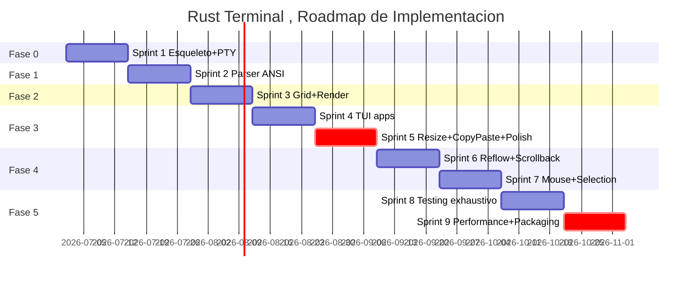

```yaml
titulo: "Roadmap Operativo , Detalle por Sprint"
tipo: especificacion
autor: "Carlos Canabal Cordero"
fecha_creacion: "2026-06-14"
fecha_modificacion: "2026-06-14"
version: "0.1.0"
estado: borrador
tags: [roadmap, sprints, fases, operativo, implementacion, milestones]
```

# Roadmap Operativo , Detalle por Sprint

## 1. Resumen

Este documento complementa
`docs/decisions/ADR-0008-roadmap-mvp.md` con el
detalle operativo del roadmap: tareas por sprint,
estimaciones de tiempo, dependencias técnicas, y
criterios de aceptacion por tarea. La decision de
alto nivel (6 fases, MVP en Fase 3) vive en el
ADR-0008. Este doc se enfoca en la implementación
semana a semana.

## 2. Convenciones de Estimacion

- **S (Small):** 1-2 dias. Tarea con diseno claro,
sin investigacion previa necesaria.
- **M (Medium):** 3-5 dias. Tarea que requiere
investigacion de API o integracion, pero sin
ambiguedad arquitectonica.
- **L (Large):** 1-2 semanas. Tarea con multiples
sub-componentes, requiere diseno cuidadoso.
- **XL (Extra Large):** 3+ semanas. Dividir en
sub-tareas antes de empezar.

## 3. Fase 0: Esqueleto + PTY

**Duracion total:** 1 sprint (~2 semanas)

**Objetivo:** ventana winit que se abre, PTY creado,
bash arranca, output basico se ve (puede ser texto
sin render elaborado).

### Sprint 1 (Semanas 1-2)


| Tarea                                                            | Estimacion | Dependencias  | Criterio de aceptacion                         |
| ---------------------------------------------------------------- | ---------- | ------------- | ---------------------------------------------- |
| Setup del proyecto Cargo                                         | S          | Ninguna       | `cargo run` ejecuta un hello world             |
| Configurar `cargo fmt`, `cargo clippy`                           | S          | Setup         | `cargo clippy` pasa sin warnings               |
| Crear `src/main.rs` con hello world                              | S          | Setup         | Binario ejecuta                                |
| Crear estructura de modulos vacia                                | S          | Setup         | `src/pty/`, `src/grid/`, etc. existen          |
| Implementar `Pty::open()` con `nix::pty::openpty`                | M          | Setup         | Test unitario: openpty retorna FDs validos     |
| Implementar `Pty::spawn(shell, args)` con `Command` + `pre_exec` | L          | Pty::open     | Test integration: bash arranca                 |
| Crear ventana con winit                                          | M          | Setup         | Ventana visible al ejecutar                    |
| Loop de eventos basico                                           | M          | ventana       | WindowEvent::CloseRequested termina el proceso |
| Hilo PTY separado que lee bytes                                  | M          | Pty::spawn    | Bytes del shell se leen                        |
| Comunicacion GUI <-> PTY vía mpsc                                | M          | Hilo PTY      | Input se envia al shell                        |
| Logging basico con tracing                                       | S          | Setup         | tracing::info!() funciona                      |
| Documento iter-06-investigacion-X.md limpio                      | S          | Investigacion | Subagentes entregan archivos                   |


**Demo al final del Sprint 1:**

```bash
$ cargo run
# Ventana se abre
# En la ventana: prompt de bash "$"
# Escribir "echo hola\n" muestra "hola"
# Ctrl+C no mata el emulador
# Cerrar ventana termina el proceso
```

## 4. Fase 1: Parser ANSI Basico

**Duracion total:** 1 sprint (~2 semanas)

**Objetivo:** el parser vte reconoce SGR (color),
cursor movement, clear screen/line, y escribe al grid.

### Sprint 2 (Semanas 3-4)


| Tarea                                                  | Estimacion | Dependencias   | Criterio de aceptacion          |
| ------------------------------------------------------ | ---------- | -------------- | ------------------------------- |
| Integrar crate `vte` 0.15                              | S          | Fase 0         | `use vte;` funciona             |
| Definir `Term` que implementa `Handler`                | M          | vte            | Compila                         |
| Wire bytes del PTY al parser                           | M          | Hilo PTY, vte  | Bytes alimentan el parser       |
| Manejar `print(c)` en el Handler                       | M          | Term           | Caracteres se escriben al grid  |
| Manejar CSI cursor movement (A/B/C/D/H)                | M          | Handler        | Cursor se mueve correctamente   |
| Manejar CSI SGR (colores 30-37, 40-47, 90-97)          | M          | Handler        | Color se aplica                 |
| Manejar CSI clear (J, K)                               | M          | Handler        | Pantalla y linea se limpian     |
| Manejar ESC[?25h/l (cursor visible)                    | S          | Handler        | Cursor aparece/desaparece       |
| Unit tests para cada secuencia                         | M          | Implementacion | `cargo test` pasa               |
| Render placeholder: dibujar grid como bloques de color | L          | Grid, parser   | Colores son visibles en ventana |


**Demo al final del Sprint 2:**

```bash
$ cargo run
# Ventana se abre
# Prompt de bash aparece
# $ echo -e "\e[31mROJO\e[0m"
# "ROJO" se ve en rojo
# $ echo -e "\e[2J"
# Pantalla se limpia
# $ echo -e "\e[5;10H"
# Cursor salta a linea 5, columna 10
```

## 5. Fase 2: Grid Basico + Render

**Duracion total:** 1 sprint (~2 semanas)

**Objetivo:** grid de 80x24 se renderiza en pantalla
con wgpu y glyphon. Texto monospace, 16 colores, SGR
basico (bold, italic, underline, reverse).

### Sprint 3 (Semanas 5-6)


| Tarea                                                | Estimacion | Dependencias        | Criterio de aceptacion               |
| ---------------------------------------------------- | ---------- | ------------------- | ------------------------------------ |
| Integrar crate `winit` 0.30 (ya en Fase 0)           | S          | -                   | -                                    |
| Integrar crate `wgpu` 29                             | M          | winit               | Contexto wgpu se crea                |
| Integrar crate `glyphon` 0.11                        | M          | wgpu                | Texto se renderiza                   |
| Crear `WgpuContext` con surface, device, queue       | M          | wgpu                | Contexto inicializa                  |
| Cargar font del sistema con glyphon                  | M          | glyphon             | Font carga                           |
| Glyph atlas: textura 1024x1024                       | L          | wgpu                | Atlas se crea                        |
| Glyph cache con precarga ASCII                       | M          | atlas               | ASCII pre-cacheado                   |
| Mapear grid a coordenadas de pantalla                | M          | Grid, atlas         | Posicion correcta                    |
| Render de texto desde grid                           | L          | Atlas, cache, mapeo | Texto visible                        |
| Damage tracking (solo renderizar celdas modificadas) | L          | Render              | Render eficiente                     |
| Render de SGR (bold, italic, underline, reverse)     | M          | Render              | Estilos visibles                     |
| Integrar con event loop (redraw en UserEvent)        | M          | Event loop          | Render se actualiza al recibir bytes |
| Unit tests para grid, atlas, cache                   | M          | Implementacion      | Pasan                                |
| Benchmarks con criterion                             | M          | Implementacion      | criterion compila                    |


**Demo al final del Sprint 3:**

```bash
$ cargo run
# Ventana 800x600 con texto monospace
# 80x24 grid visible
# Prompt de bash con colores
# $ ls --color=auto
# Salida de ls con colores
# $ git status
# Salida de git con verde/rojo
# Resize de ventana se ve fluido (sin lag visible)
```

## 6. Fase 3: MVP Funcional

**Duracion total:** 2 sprints (~4 semanas). Fase mas
larga y riesgosa del proyecto.

**Objetivo:** integracion completa. El usuario puede
ejecutar comandos basicos, ver output con colores,
hacer clear, resize, y abrir apps TUI simples (vim,
htop).

### Sprint 4 (Semanas 7-8): TUI apps


| Tarea                                       | Estimacion | Dependencias     | Criterio de aceptacion      |
| ------------------------------------------- | ---------- | ---------------- | --------------------------- |
| Soporte de alternate screen (DEC 1049)      | L          | Fase 1           | vim/htop usan alt screen    |
| Backup de pantalla primaria al entrar alt   | M          | Alternate screen | Restauracion correcta       |
| Scroll región (DECSTBM)                     | M          | Grid             | Scroll respeta región       |
| DECSC/DECRC (save/restore cursor)           | M          | Cursor           | Save/restore funciona       |
| DECAWM (auto wrap)                          | M          | Cursor           | Wrap en ultima columna      |
| Insert/delete line (IL/DL)                  | M          | Grid             | IL/DL funcionan             |
| Insert/delete char (ICH/DCH)                | M          | Grid             | ICH/DCH funcionan           |
| Mouse parsing mínimo (no reporting todavia) | S          | Parser           | Eventos de mouse se ignoran |
| Unit tests para cada feature nueva          | M          | Implementacion   | Pasan                       |
| Integration test: vim abre y edita          | M          | Alt screen       | Test pasa                   |


### Sprint 5 (Semanas 9-10): Resize, copy/paste, polish


| Tarea                                   | Estimacion | Dependencias    | Criterio de aceptacion    |
| --------------------------------------- | ---------- | --------------- | ------------------------- |
| SIGWINCH: `ioctl(TIOCSWINSZ)` al resize | M          | Event loop      | bash ajusta COLUMNS       |
| Resize del grid al cambiar tamano       | M          | SIGWINCH        | Grid se redimensiona      |
| Resize del renderer al cambiar tamano   | M          | SIGWINCH        | Render se actualiza       |
| Clipboard X11/Wayland basico            | L          | Event loop      | Ctrl+Shift+C/V funciona   |
| Bracketed paste mode (DEC 2004)         | M          | Parser          | Pegado respeta mode       |
| Filtrar ESC/ETX del paste               | S          | Bracketed paste | Sin inyección             |
| Scroll basico (sin reflow)              | M          | Grid            | Scroll up/down funciona   |
| Decodificar 7-bit y 8-bit control       | S          | Parser          | Ambos funcionan           |
| Manejar errores de I/O del PTY          | M          | Hilo PTY        | Errores no panic          |
| Shutdown graceful con SIGHUP            | M          | Pty::Drop       | Child recibe SIGHUP       |
| 10-min smoke test (sesión manual)       | L          | Todo            | 0 panics en 10 min        |
| Documentacion de usuario basica         | M          | Todo            | README explica uso basico |


**Demo al final del Sprint 5 (MVP completo):**

```bash
$ cargo run
# Ventana se abre
# vim archivo.txt -> edita, guarda, sale
# htop -> muestra procesos, navega, sale
# less archivo_grande -> navega, sale
# tmux -> crea sesiones, multiples paneles
# ssh usuario@host -> conecta, trabaja, sale
# Ctrl+Shift+C/V -> copy/paste
# Resize de ventana -> contenido se ajusta
# Cerrar ventana -> child recibe SIGHUP, no hay huerfanos
```

## 7. Fase 4: Refinamiento

**Duracion total:** 2 sprints (~4 semanas)

**Objetivo:** reflow de lineas al resize, selección
de texto con mouse, mouse reporting, scrollback 100
lineas.

### Sprint 6 (Semanas 11-12): Reflow y scrollback


| Tarea                                     | Estimacion | Dependencias | Criterio de aceptacion |
| ----------------------------------------- | ---------- | ------------ | ---------------------- |
| Reflow de lineas al resize                | L          | Grid         | Lineas se re-dividen   |
| Scrollback ring buffer (100 lineas MVP)   | M          | Grid         | Scrollback funciona    |
| PageUp/PageDown navega scrollback         | M          | Scrollback   | Teclas funcionan       |
| Reflow solo en pantalla primaria          | M          | Reflow       | Alt screen sin reflow  |
| Benchmarks de scroll latency              | S          | Scrollback   | criterion compila      |
| Integration test: comando con 1000 lineas | M          | Scrollback   | Test pasa              |


### Sprint 7 (Semanas 13-14): Mouse y selection


| Tarea                                              | Estimacion | Dependencias     | Criterio de aceptacion |
| -------------------------------------------------- | ---------- | ---------------- | ---------------------- |
| Render del cursor de mouse                         | M          | Renderer         | Cursor visible         |
| Click + drag selecciona texto                      | L          | Mouse, selection | Seleccion visual       |
| Triple-click selecciona linea                      | M          | Selection        | Funciona               |
| Doble-click selecciona palabra                     | M          | Selection        | Funciona               |
| Mouse reporting SGR (1006)                         | L          | Parser           | vim recibe eventos     |
| Mouse reporting Normal (1000)                      | M          | Parser           | Mouse basico funciona  |
| Shift bypass para selección local                  | S          | Mouse            | Shift+click selecciona |
| Copy de selección al clipboard                     | M          | Selection        | Copia funciona         |
| 4 modos de selección (Simple/Block/Semantic/Lines) | L          | Selection        | Todos funcionan        |
| 10-min smoke test con mouse                        | M          | Mouse            | Sin panics             |


**Demo al final del Sprint 7:**

```bash
$ cargo run
# Resize a ventana mas pequena -> lineas se re-dividen
# Resize a ventana mas grande -> lineas se fusionan
# Scrollback: ejecutar "for i in {1..200}; do echo $i; done"
#   -> se ven 200 lineas, PageUp/PageDown navega
# vim con mouse: click posiciona cursor, drag selecciona
# Click + Ctrl+Shift+C -> copia al clipboard
# Mouse reporting: tmux responde a clicks
```

## 8. Fase 5: Produccion

**Duracion total:** 2 sprints (~4 semanas)

**Objetivo:** testing exhaustivo, performance 60fps en
200x50, benchmarks, packaging, portabilidad.

### Sprint 8 (Semanas 15-16): Testing exhaustivo


| Tarea                             | Estimacion | Dependencias | Criterio de aceptacion        |
| --------------------------------- | ---------- | ------------ | ----------------------------- |
| vttest categoría 1-4 pasan        | L          | Parser, grid | Ejecucion manual              |
| esctest subset critico            | M          | Parser       | CI corre sin fallos           |
| Property-based tests con proptest | L          | Grid, parser | `cargo test` incluye proptest |
| Cobertura >50% global             | M          | Tests        | `cargo tarpaulin` reporta     |
| CI en GitHub Actions              | M          | Tests        | PRs ejecutan CI               |
| Benchmarks con cargo-criterion    | M          | Bench        | CI mide regresiones           |
| Documentacion de API con rustdoc  | M          | Codigo       | `cargo doc` genera docs       |


### Sprint 9 (Semanas 17-18): Performance y packaging


| Tarea                                       | Estimacion | Dependencias | Criterio de aceptacion     |
| ------------------------------------------- | ---------- | ------------ | -------------------------- |
| Optimizar render path (60fps en 200x50)     | L          | Renderer     | Benchmark cumple           |
| Optimizar parser (>500 MB/s)                | M          | Parser       | Benchmark cumple           |
| Optimizar scroll (<1ms)                     | M          | Grid         | Benchmark cumple           |
| Panic hook custom (Fase 5 segun ADR-0007)   | M          | Logging      | Panic muestra notificacion |
| Script de build con `cargo build --release` | S          | -            | Binario produccion         |
| AppImage para distribucion Linux            | M          | Build        | AppImage funcional         |
| Documentacion de usuario completa           | M          | Todo         | README + manpage           |
| Portabilidad macOS (opcional)               | L          | Refactor     | Compila en macOS           |


**Demo al final del Sprint 9 (Produccion):**

```bash
$ cargo build --release
# Binario en target/release/baud, <15MB

$ ./target/release/baud
# 60fps en 200x50
# <100MB de memoria
# vttest categoria 1-4: 100% pass
# 0 panics en 1 hora de uso
# Panic hook: muestra notificacion si ocurre
```

## 9. Timeline Visual




## 10. Milestones


| Milestone         | Sprint       | Entregable visible  |
| ----------------- | ------------ | ------------------- |
| M0: Hello PTY     | Fin Sprint 1 | bash en ventana     |
| M1: ANSI basico   | Fin Sprint 2 | Colores en pantalla |
| M2: Render GPU    | Fin Sprint 3 | Grid 80x24 visible  |
| M3: MVP funcional | Fin Sprint 5 | vim/htop funcionan  |
| M4: Refinamiento  | Fin Sprint 7 | Mouse y reflow      |
| M5: Produccion    | Fin Sprint 9 | Release 0.0.1       |


## 11. Riesgos y Mitigaciones por Fase


| Fase | Riesgo                          | Mitigacion                               |
| ---- | ------------------------------- | ---------------------------------------- |
| 0    | nix API confusa                 | Documentar con ejemplos de Alacritty     |
| 1    | Secuencias ANSI no documentadas | Usar xterm ctlseqs como referencia       |
| 2    | Performance del render          | Empezar con mock, optimizar al final     |
| 3    | Bugs de integracion             | Testing continuo, no dejar para el final |
| 4    | Reflow complejo                 | Copiar implementación de Alacritty       |
| 5    | CI ruidoso                      | Threshold del 15% en benchmarks          |


## 12. Limitaciones

1. **El timeline asume desarrollador solo.** Con 2+
  desarrolladores, se puede paralelizar Fase 2 y 3.
2. **Las estimaciones son optimistas.** Agregar 30%
  de buffer para imprevistos.
3. **Fase 5 incluye portabilidad macOS opcional.** Si
  se requiere Windows, agregar 2-3 sprints mas.
4. **Los benchmarks en CI son ruidosos.** Se acepta
  varianza del 15%.
5. **No incluye plan de contribucion externa.** Si
  llegan PRs, agregar 1 sprint de code review.

## 13. Referencias

- docs/decisions/ADR-0008-roadmap-mvp.md (decision
de alto nivel).
- docs/prompts/iter-06-investigacion-F.md
(investigacion base).
- docs/specs/requisitos.md (RF y RNF detallados).
- Mitchell Hashimoto. Ghostty development blog.
[https://mitchellh.com/ghostty](https://mitchellh.com/ghostty)
- Joe Wilm. "Life of a Terminal Emulator".
[https://jwilm.io/blog/](https://jwilm.io/blog/)

## Cambios


| Version | Fecha      | Cambios                                                         |
| ------- | ---------- | --------------------------------------------------------------- |
| 0.1.0   | 2026-06-14 | Primer borrador. 9 sprints detallados, dependencias, criterios. |


